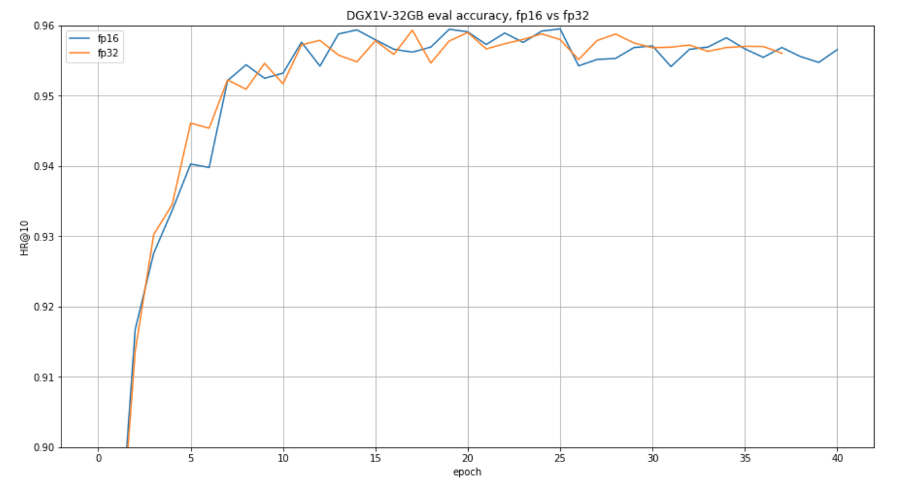

# Neural Collaborative Filtering (NCF)

## The model
The NCF model focuses on providing recommendations, also known as collaborative filtering; with implicit feedback. The training data for this model should contain binary information about whether a user interacted with a specific item.
NCF was first described by Xiangnan He, Lizi Liao, Hanwang Zhang, Liqiang Nie, Xia Hu and Tat-Seng Chua in the [Neural Collaborative Filtering paper](https://arxiv.org/abs/1708.05031).

The implementation in this repository is modified to use dropout in the FullyConnected layers. 
This reduces overfitting and increases the final accuracy.

Contrary to the original paper, we benchmark the model on the larger [ml-20m dataset](https://grouplens.org/datasets/movielens/20m/)
instead of using the smaller [ml-1m](https://grouplens.org/datasets/movielens/1m/) dataset.

## Requirements

The easiest way to train the model is to use a Docker container. This would require:
* [nvidia-docker](https://github.com/NVIDIA/nvidia-docker)
* [PyTorch 18.12-py3 NGC container](https://ngc.nvidia.com/registry/nvidia-pytorch)

For more information about how to get started with NGC containers, see the
following sections from the NVIDIA GPU Cloud Documentation and the Deep Learning
Frameworks Documentation:
* [Getting Started Using NVIDIA GPU Cloud](https://docs.nvidia.com/ngc/ngc-getting-started-guide/index.html)
* [Accessing And Pulling From The NGC Container Registry](https://docs.nvidia.com/deeplearning/dgx/user-guide/index.html#accessing_registry)
* [Running PyTorch](https://docs.nvidia.com/deeplearning/dgx/pytorch-release-notes/running.html#running)


## Training using mixed precision with Tensor Cores
Before you can train using mixed precision with Tensor Cores, ensure that you have a
[NVIDIA Volta](https://www.nvidia.com/en-us/data-center/volta-gpu-architecture/) based GPU.
For information about how to train using mixed precision, see the
[Mixed Precision Training paper](https://arxiv.org/abs/1710.03740)
and
[Training With Mixed Precision documentation](https://docs.nvidia.com/deeplearning/sdk/mixed-precision-training/index.html).

This implementation of the NCF model uses a custom FP16 optimizer to implement mixed precision with static loss scaling.
The custom FP16 Optimizer was used to take advantage of the performance gains provided by the FusedOptimizer.

## Quick start guide

### 1. Data preparation

The training data can be downloaded with the download_dataset.sh script.
Preprocessing consists of filtering out users that have less than 20 ratings (by default), sorting the data and dropping the duplicates.
The preprocessed train and test data is then saved in PyTorch binary format to be loaded just before training.

No data augmentation techniques are used.

#### Other datasets

This implementation is tuned for the ml-20m and ml-1m datasets. Using other datasets might require tuning some hyperparameters (e.g., learning rate, beta1, beta2)

The performance of the model depends on the dataset size. Generally, the model should scale better for datasets containing more interactions. For a smaller dataset the you might experience slower performance.

### 2. Build and launch the NCF Docker container

After Docker is correctly set up, the NCF container can be built and launched with:
```bash
docker build -f Dockerfile . --rm -t nvidia_ncf
nvidia-docker run -it --rm --ipc=host nvidia_ncf bash
```

### 3. Run the training
After the docker container is launched, the training can be started with:

```bash
./run.sh
```

This command will also download and preprocess the ml-20m dataset.

### 4. Test a trained model

After training a model, you can evaluate it with by passing the --mode test flag to the run.sh script:
```bash
run.sh --mode test --checkpoint-path model.pth
```

This command reads the model weights from the provided PyTorch state-dict saved previously by the training script and runs a single evaluation on it. 


### 5. Hyperparameters

The default hyperparameters used are:

* learning rate: 0.0045
* beta1: 0.25
* beta2: 0.5
* training batch size: 1048576
* epsilon: 1e-8
* loss scale: 8192
* negatives sampled for training: 4
* use mixed precision training: Yes
* number of GPUs used: 8

All these parameters can be controlled by passing command line arguments to the run.sh script. 


## Training accuracy results

The following table lists the best hit rate at 10 for DGX-1 with 8 V100 32G GPUs:

| **number of GPUs** | **FP32 HR@10** | **Mixed precision HR@10** | 
|:---:|:--------:|:-------:|
|1|	0.959015 |0.959485|
|4|	0.959389 |0.959274|
|8|	0.959015 |0.96|

Here's an example validation accuracy curve for FP16 vs FP32 on DGX-1 with 8 V100 32G GPUs:



## Training performance results


### NVIDIA DGX-1 with 8 V100 16G GPUs

The following table shows the best training throughput (in samples per second):

| **number of GPUs** | **mixed precision** | **fp32** | **speedup** | 
|:---:|:-------------:|:-----------:|:-----:|
| 1 | 20 027 840 | 9 529 271 | 2.10 |
| 4 | 62 633 260| 32 719 700 | 1.91 |
| 8 | 99 332 230| 55 004 590 | 1.81 |


### NVIDIA DGX-1 with 8 V100 32G GPUs

The following table shows the best training throughput (in samples per second):
	
| **number of GPUs** | **mixed precision** | **fp32** | **speedup** | 
|:---:|:-------------:|:-----------:|:-----:|
| 1 | 18 871 650 | 9 206 424 | 2.05 |
| 4 | 59 413 640 | 31 898 870 | 1.86 |
| 8 | 94 752 770 | 53 645 640 | 1.77 |


## Inference performance results

### NVIDIA DGX-1 with 8 V100 16G GPUs

The following table shows the best inference throughput (in samples per second):

| **number of GPUs** | **mixed precision** | **fp32** | **speedup** | 
|:---:|:-------------:|:-----------:|:-----:|
| 1 | 58 836 420 | 28 964 964 | 2.03 |

### NVIDIA DGX-1 with 8 V100 32G GPUs

The following table shows the best inference throughput (in samples per second):

| **number of GPUs** | **mixed precision** | **fp32** | **speedup** | 
|:---:|:-------------:|:-----------:|:-----:|
| 1 | 55 317 010 | 28 470 920 | 1.94 |


## Changelog
1. December 19, 2018
    * Initial release


## Known issues 
### Scaling beyond 8 GPUs
Neural Collaborative Filtering is a relatively lightweight model that trains quickly.
Because of that the high ratio of communication to computation makes it difficult to 
efficiently use more than 8 GPUs. Normally this is not an issue because when using 8
GPUs with fp16 precision the training is sufficiently fast. However, if you’d like to
 scale the training to 16 GPUs and beyond you might try modifying the model so that 
 the communication-computation ratio facilitates better scaling. This could be done e.g.,
  by finding hyperparameters that enable using a larger batch size or by reducing the 
  number of trainable parameters.

### Memory usage
Training on a single GPU with less than 16GB of memory or switching off FP16 mode might result in
out-of-memory errors. To reduce memory usage you can use gradient accumulation and a smaller batch
to accumulate multiple batches into a single weight update:

```bash
run.sh --grads_accumulated 2 --batch-size 524288
```
